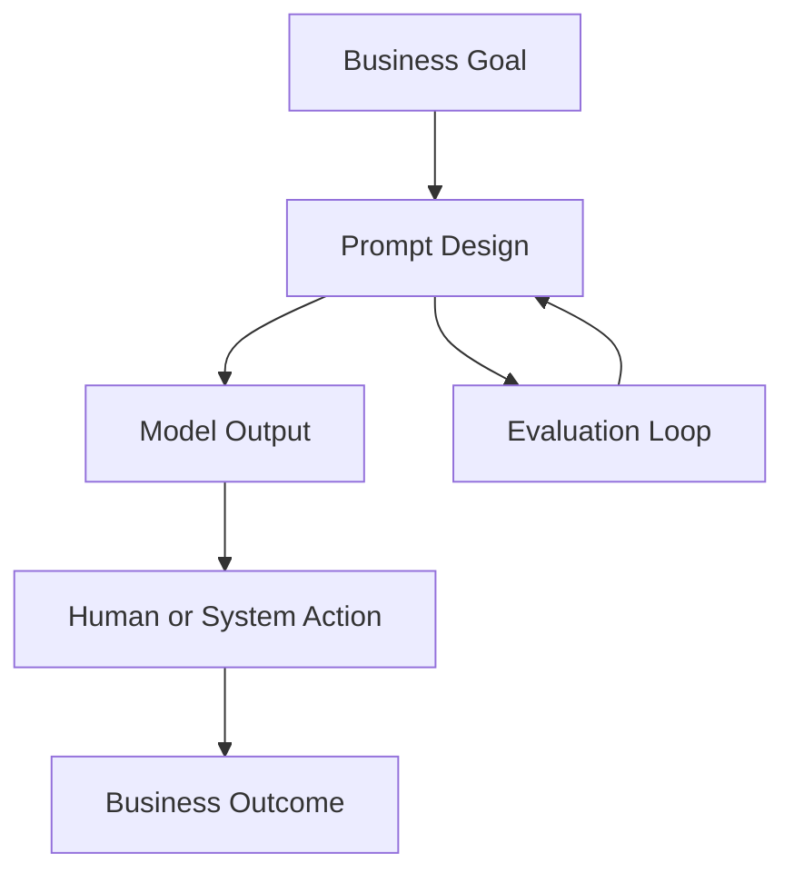
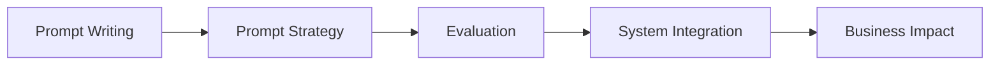
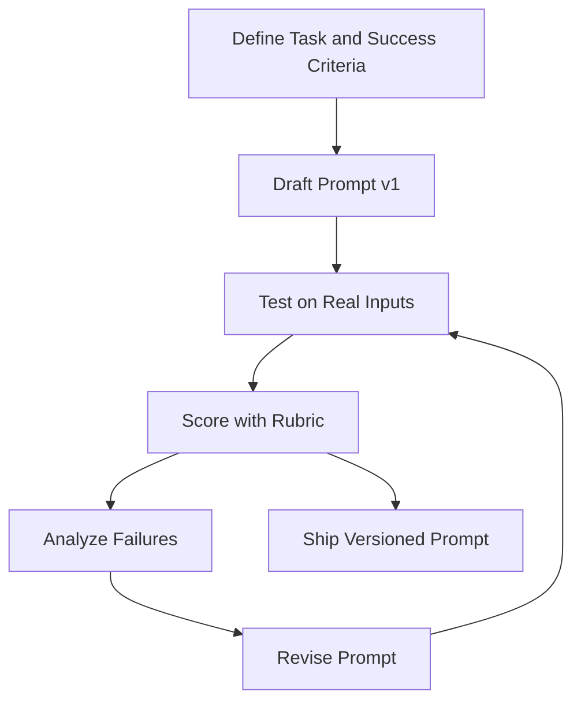

# Chapter 1: The Rise of the Prompt Engineer in 2026

## 1.1 Introduction

Prompt engineering has evolved from a niche experimentation skill into a core professional capability across software, product, education, operations, and consulting. In 2026, organizations are no longer asking whether to use generative AI; they are asking how to use it reliably, safely, and profitably.

This is where prompt engineers create value.

A prompt engineer is not just a person who writes good instructions. A prompt engineer designs repeatable interaction systems between humans, models, tools, and business goals.

---

## 1.2 What Changed Between Early AI Adoption and 2026

Early adoption focused on novelty: "Can AI do this task?"

By 2026, the focus is production value:

- Can AI do this task consistently?
- Can outputs meet quality and policy requirements?
- Can we reduce cost, risk, and rework?
- Can teams operationalize AI across workflows?

Prompt engineering became critical because model capability increased faster than team capability. The bottleneck moved from model intelligence to instruction quality, evaluation discipline, and workflow design.

---

## 1.3 Who Is a Prompt Engineer?

A modern prompt engineer combines:

- Language design: Clear, constrained, unambiguous instructions
- Task design: Decomposition of complex goals into manageable steps
- Quality control: Rubrics, tests, and iteration loops
- Domain understanding: Legal, medical, finance, coding, marketing, education, etc.
- System awareness: Context windows, retrieval, tools, and agent behavior

Prompt engineering is therefore both a communication discipline and a systems discipline.

---

## 1.4 Why Prompt Engineering Is a High-Leverage Skill



A small improvement in prompt quality can create large downstream gains:

- Higher accuracy and fewer hallucinations
- Lower token usage and lower operational cost
- Faster turnaround for teams and clients
- Better compliance with formatting and policy rules
- More predictable behavior in automated systems

---

## 1.5 Prompt Engineer Role Map in 2026

Prompt engineering appears in multiple job shapes:

1. Product Prompt Engineer
Designs prompts inside software products and AI features.

2. Operations Prompt Engineer
Builds internal automations for support, documentation, reporting, and workflows.

3. Domain Prompt Specialist
Focuses on one domain (for example healthcare or law) and maps domain constraints into prompt templates.

4. Prompt QA and Evaluation Specialist
Creates test sets, scoring rubrics, and failure analysis pipelines.

5. Prompt Consultant or Freelancer
Helps clients improve output quality, reduce cost, and deploy reusable prompt systems.

---

## 1.6 Core Competency Stack



### Level 1: Prompt Writing
- Role, task, context, constraints, output format

### Level 2: Prompt Strategy
- Zero-shot vs few-shot, decomposition, self-checking patterns

### Level 3: Evaluation
- Rubrics, acceptance criteria, edge-case testing

### Level 4: System Integration
- RAG context, tool calling, memory, routing logic

### Level 5: Business Impact
- KPIs, cost-quality tradeoffs, scalability, governance

---

## 1.7 Common Misconceptions

### Misconception 1: "Prompt engineering is just better wording"
Reality: Wording matters, but structure, constraints, examples, and evaluation matter more.

### Misconception 2: "Better models remove the need for prompt skills"
Reality: Better models increase opportunity, but reliability still depends on instruction design and validation.

### Misconception 3: "One perfect prompt solves everything"
Reality: Production systems use prompt sets, fallback logic, and continuous iteration.

### Misconception 4: "Prompt engineering has no career path"
Reality: It is now embedded in product, AI operations, consulting, and agent workflow roles.

---

## 1.8 A Professional Prompt Engineering Workflow



Use this loop for every meaningful prompt asset. Prompt engineering is most effective when treated like engineering, not improvisation.

---

## 1.9 Real-World Use Cases

- Customer support response drafting with policy-safe tone
- Sales outreach personalization at scale
- Technical document summarization with strict formatting
- Code assistant workflows with architecture constraints
- Learning content generation with curriculum standards
- Internal copilots for knowledge retrieval and action planning

Each use case benefits from explicit prompt templates, structured output contracts, and evaluation metrics.

---

## 1.10 Chapter 1 Practical Exercise

### Exercise: Convert a vague request into an engineering-grade prompt

Vague request:

"Write an email to a customer about delayed delivery."

Your task:

1. Add role and objective
2. Add context and constraints
3. Define tone and prohibited language
4. Force output format
5. Add a self-check instruction

Starter template:

```text
You are [role].
Objective: [what success looks like].
Context: [facts the model must use].
Constraints:
1) [constraint]
2) [constraint]
3) [constraint]
Output format:
- Subject:
- Body (max 120 words):
Quality check before final answer:
- Verify [condition 1]
- Verify [condition 2]
```

---

## 1.11 Key Takeaways

- Prompt engineering is a strategic skill in 2026, not a temporary trend.
- The role is interdisciplinary: language, systems, quality, and business value.
- Professional impact comes from repeatable workflows, not one-off prompts.
- Strong prompt engineers think in loops: design, test, evaluate, improve.

---

## 1.12 Next Chapter

In Chapter 2, we will study how LLMs actually "think" in practice through tokens, context windows, and temperature, so your prompt decisions become technically grounded rather than guesswork.
