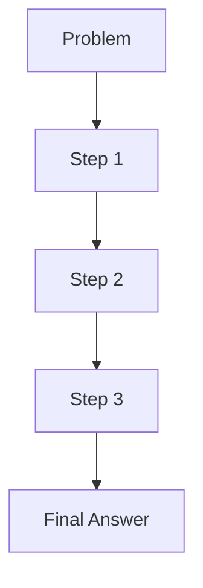
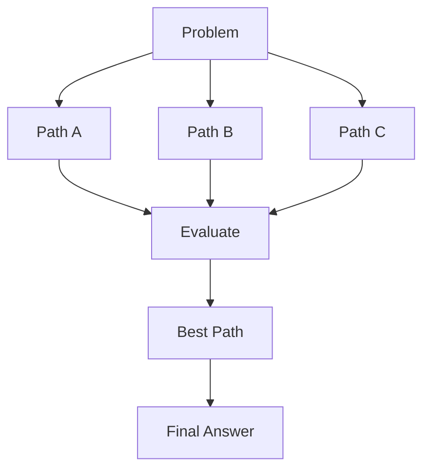

# Chapter 5: Chain-of-Thought (CoT) and Tree-of-Thought

## 5.1 Introduction

As tasks become complex, direct prompting can fail because the model jumps to an answer without sufficient reasoning steps. Reasoning-oriented prompting helps by guiding the model to decompose problems.

This chapter introduces two important methods:

- Chain-of-Thought (CoT): linear step-by-step reasoning
- Tree-of-Thought (ToT): branching reasoning with alternatives

---

## 5.2 Why Reasoning Prompts Matter

Complex tasks often involve:

- Multi-step logic
- Ambiguous requirements
- Tradeoff decisions
- Intermediate verification

Without structured reasoning, outputs may sound confident but be incorrect.

---

## 5.3 Chain-of-Thought (CoT)

CoT encourages sequential decomposition.



### When to Use CoT

- Math and logic tasks
- Debugging analysis
- Multi-constraint planning
- Policy interpretation from provided rules

### CoT Prompt Pattern

```text
Solve the problem step by step.
Show intermediate reasoning clearly.
Then provide a concise final answer.
```

Note: In production, you may prefer hidden internal reasoning with only final structured output, depending on policy and UX requirements.

---

## 5.4 Tree-of-Thought (ToT)

ToT explores multiple reasoning paths, then selects the best path.



### When to Use ToT

- Strategy design
- Creative ideation with constraints
- Complex decision-making
- Cases where first answer is often suboptimal

---

## 5.5 CoT vs ToT Comparison

| Dimension | CoT | ToT |
|---|---|---|
| Structure | Linear | Branching |
| Cost | Lower | Higher |
| Best for | Procedural reasoning | Exploratory reasoning |
| Latency | Lower | Higher |
| Quality ceiling on hard tasks | Medium-High | High |

---

## 5.6 Practical Prompt Patterns

### Pattern A: CoT with Verification

```text
Task: [problem]
Instructions:
1) Break into clear steps
2) Solve each step
3) Verify consistency with constraints
4) Return final answer in [format]
```

### Pattern B: ToT with Candidate Ranking

```text
Task: [problem]
Generate 3 candidate solution paths.
For each path, evaluate:
- Feasibility
- Risk
- Expected quality
Pick the best path and provide final output.
Return as a table + final recommendation.
```

---

## 5.7 Failure Modes and Safeguards

Common issues:

- Overlong reasoning with little added value
- Invented intermediate facts
- Weak evaluation criteria in ToT branches
- Cost explosion due to excessive branches

Safeguards:

- Limit steps or branches explicitly
- Require evidence from provided context only
- Define scoring rubric before branching
- Force concise final synthesis

---

## 5.8 Mini Case Study

Problem: "Design a 30-day learning plan for a beginner entering prompt engineering while working full-time."

- CoT produces a straightforward schedule quickly.
- ToT can explore alternatives (time-heavy, weekend-heavy, project-heavy), compare tradeoffs, then choose the best fit.

ToT is often better when personalization and tradeoff balancing matter.

---

## 5.9 Chapter 5 Practical Exercise

1. Pick a complex task (planning, strategy, debugging, or analysis).
2. Solve once with direct prompting.
3. Solve with CoT.
4. Solve with ToT (3 branches max).
5. Compare results on:
- Accuracy
- Clarity
- Constraint fit
- Cost
- Latency

Write a short conclusion on when the extra reasoning cost is justified.

---

## 5.10 Key Takeaways

- CoT helps with linear, multi-step tasks.
- ToT helps when alternative solution paths must be explored.
- Reasoning scaffolds improve reliability but increase cost.
- Use explicit limits and evaluation criteria to control reasoning quality.

---

## 5.11 Next Chapter

In Chapter 6, we will formalize prompt design with the CO-STAR framework and system prompts for production-level consistency.
