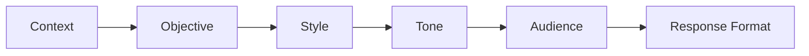
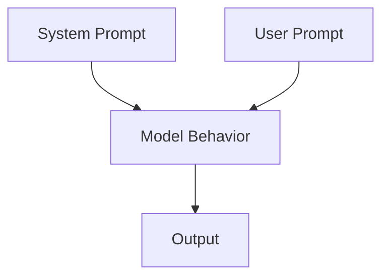
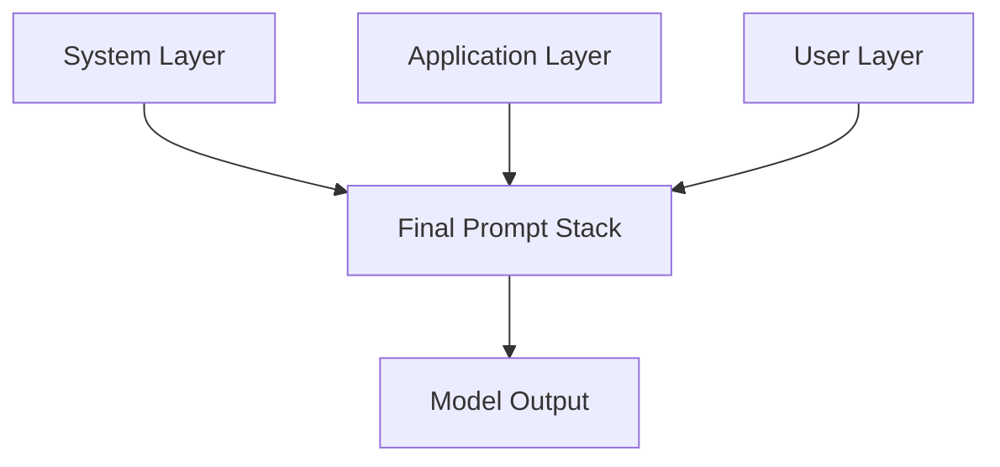

# Chapter 6: The CO-STAR Framework & System Prompts

## 6.1 Introduction

Ad-hoc prompting is hard to scale. Frameworks make prompt quality repeatable.

CO-STAR is a practical structure for high-control prompt design, especially in team settings. Combined with system prompts, it enables consistent behavior across sessions and users.

---

## 6.2 CO-STAR Framework Breakdown

CO-STAR stands for:

- C: Context
- O: Objective
- S: Style
- T: Tone
- A: Audience
- R: Response Format



Each component reduces ambiguity and narrows the model's output space.

---

## 6.3 CO-STAR in Practice

### Template

```text
Context: [background and relevant facts]
Objective: [specific outcome]
Style: [writing style or structure preference]
Tone: [formal, friendly, neutral, persuasive, etc.]
Audience: [who will read/use this]
Response: [required format, length, sections]
```

### Example

```text
Context: A SaaS company is launching a new analytics feature for SMB customers.
Objective: Draft a feature announcement email.
Style: Clear and concise business communication.
Tone: Professional and optimistic.
Audience: Existing SMB customers.
Response: Subject line + body under 140 words + 3 bullet benefits.
```

---

## 6.4 System Prompts vs User Prompts

System prompts define global behavior rules. User prompts define task-level requests.



### System Prompt Should Include

- Role boundaries
- Safety and policy constraints
- Response behavior defaults
- Handling of uncertainty
- Formatting standards

### User Prompt Should Include

- Task objective
- Relevant context
- Specific constraints
- Output contract

---

## 6.5 Designing Strong System Prompts

A strong system prompt is:

- Stable: reusable across many tasks
- Explicit: no vague instructions
- Non-contradictory: rules are compatible
- Minimal: only enduring behavior policies

### Example System Prompt Skeleton

```text
You are an enterprise prompt assistant.
Always follow these rules:
1) Use only provided context when factual certainty is required.
2) If required information is missing, ask clarifying questions.
3) Never invent citations or external facts.
4) Return outputs in user-requested format exactly.
5) Keep responses concise unless user requests detail.
```

---

## 6.6 Layered Prompt Architecture

Use three layers in production:

1. System layer: global behavior and guardrails
2. Developer/application layer: workflow rules and tool policies
3. User layer: task-specific request



This separation improves maintainability and debugging.

---

## 6.7 Common Implementation Mistakes

- Duplicating constraints across layers with contradictions
- Putting temporary task details in system prompt
- Overly long system prompts that reduce effective context budget
- Missing fallback behavior for uncertain inputs

Fix by versioning prompts and testing each layer independently.

---

## 6.8 Chapter 6 Practical Exercise

1. Write one reusable system prompt for a "Prompt QA Assistant."
2. Create two user prompts for different tasks:
- Task A: evaluate prompt quality
- Task B: rewrite weak prompts
3. Apply CO-STAR to both user prompts.
4. Test on 5 inputs and record:
- Consistency
- Format compliance
- Hallucination rate
- Instruction adherence

---

## 6.9 Key Takeaways

- CO-STAR provides a reliable structure for prompt clarity.
- System prompts control stable behavior across tasks.
- Layered architecture improves governance and scale.
- Prompt versioning and layer-level testing are essential in production.

---

## 6.10 Next Chapter

In Chapter 7, we expand beyond text and learn how to design prompts for multimodal systems involving images, video, and audio.
