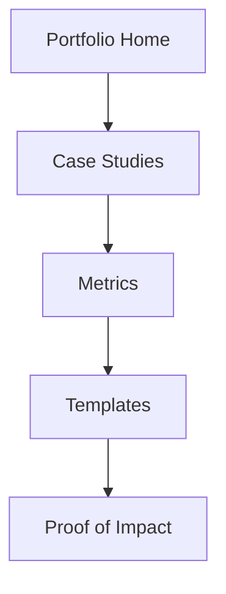

# Chapter 8: Building a Prompt Portfolio

## 8.1 Introduction

A prompt portfolio is proof of capability. It converts your skills from claims into evidence.

In 2026, hiring managers and clients want outcomes, not just "I can write prompts." Your portfolio should show repeatability, quality control, and business impact.

---

## 8.2 Portfolio Objectives

A strong portfolio should demonstrate:

- Breadth: multiple task categories
- Depth: high-quality workflow for each category
- Rigor: evaluation metrics and iteration history
- Impact: measurable outcomes (quality, speed, cost)

---

## 8.3 What to Include

Minimum recommended sections:

1. About and specialization
2. Prompt case studies
3. Before/after comparisons
4. Evaluation methodology
5. Reusable templates
6. Tools and model stack
7. Contact and engagement options

---

## 8.4 Case Study Structure (Use This Format)

For each project, document:

- Problem statement
- Context and constraints
- Prompt versions (v1, v2, v3)
- Test methodology
- Metrics and final result
- Lessons learned

### Suggested Metrics

- Accuracy rate
- Format compliance rate
- Time saved
- Token/cost reduction
- Human revision reduction

---

## 8.5 Portfolio Project Ideas

- Customer support prompt system with policy-safe outputs
- Resume-to-job matching analyzer
- Legal clause extraction prompt set
- Marketing copy generator with brand guardrails
- Meeting transcript to action-plan pipeline
- Multimodal content QA workflow

Pick projects that map to your target role or client market.

---

## 8.6 Presentation Guidelines

- Keep each case study concise and measurable
- Include prompt snippets, not only final outputs
- Show failure cases and how you fixed them
- Use clear headings and predictable structure
- Avoid confidential or personally identifiable data

---

## 8.7 Portfolio Quality Rubric

Score each case study from 0-2:

- Problem clarity
- Prompt structure quality
- Evaluation rigor
- Business relevance
- Reproducibility

Total: `/10` per case study

Target: `>= 8/10`

---

## 8.8 Chapter 8 Practical Exercise

Build one full mini case study:

1. Choose a practical task.
2. Create prompt v1.
3. Test on 10 inputs and score.
4. Improve to v2 and retest.
5. Publish final report with metrics.

Deliverable format:

- `problem.md`
- `prompt-v1.txt`
- `prompt-v2.txt`
- `test-results.csv`
- `case-study.md`

---

## 8.9 Key Takeaways

- A portfolio is your strongest credibility asset.
- Measured improvements matter more than polished claims.
- Case-study structure should be repeatable and transparent.
- Portfolios should align with the specific roles/clients you target.

---

## 8.10 Next Chapter

In Chapter 9, we convert your portfolio into income through freelancing, consulting, and prompt marketplaces.
