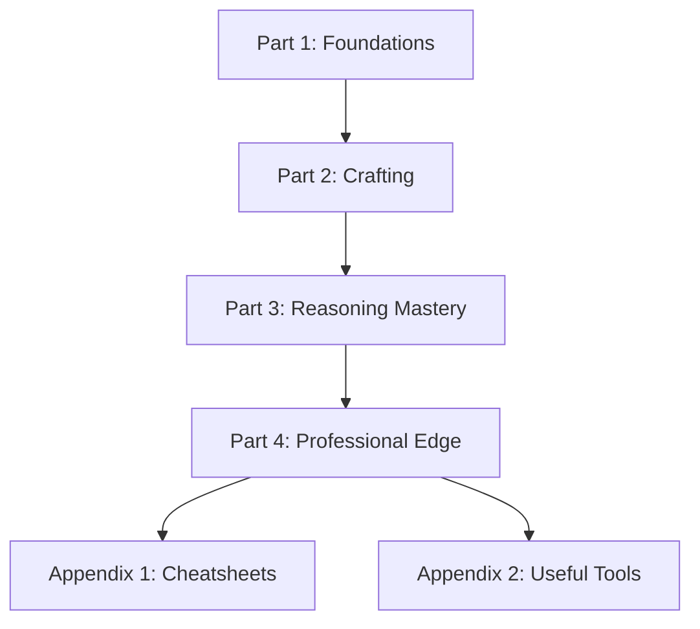
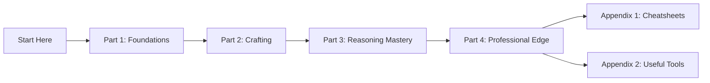

# Gen AI Prompt Engineer 101: From Basics to Mastery (2026 Edition)

A professional, beginner-to-master learning repository for **prompt engineering in the generative AI era**.

This book is designed as a chapter-based Markdown curriculum for GitHub, helping learners build practical skills from foundations to advanced agentic workflows.

---

## Scope

This course covers:

- Core prompt engineering principles and mental models
- How LLM behavior is shaped by tokens, context, and sampling
- Practical prompting patterns from zero-shot to structured frameworks
- Advanced reasoning and multimodal prompting
- Career application: portfolio building, freelancing, consulting, and monetization
- The shift from prompting chatbots to orchestrating AI agents

This course does **not** require deep ML research background to start.

---

## Learning Outcomes

By the end of this course, learners will be able to:

- Write precise, controllable prompts for diverse tasks
- Select the right prompting strategy for quality, speed, and cost
- Apply frameworks such as CoT and CO-STAR in real workflows
- Design prompts for text, image, video, and audio tasks
- Build a professional prompt portfolio
- Convert prompting skills into income opportunities
- Prepare for agent-based autonomous AI systems

---

## Book Architecture

---

## Chapter Index

### Part 1: The Foundations (The "Why" and "How")

1. [Chapter 1: The Rise of the Prompt Engineer in 2026](01-the-rise-of-prompt-engineer.md)
2. [Chapter 2: How LLMs Actually "Think" (Tokens, Context Windows, and Temperature)](02-how-llms-actually-think.md)

### Part 2: The Art of Crafting (Beginner Techniques)

3. [Chapter 3: The Anatomy of a Perfect Prompt](03-the-anatomy-of-a-perfect-prompt.md)
4. [Chapter 4: Zero-Shot vs. Few-Shot Prompting](04-zero-shot-vs-few-shot-prompting.md)

### Part 3: The Science of Reasoning (Advanced Mastery)

5. [Chapter 5: Chain-of-Thought (CoT) and Tree-of-Thought](05-chain-of-thought-and-tree-of-thought.md)
6. [Chapter 6: The CO-STAR Framework & System Prompts](06-the-co-star-framework-and-system-prompts.md)
7. [Chapter 7: Multimodal Prompting (Images, Video, and Audio)](07-multimodal-prompting-images-video-audio.md)

### Part 4: The Professional Edge (Earning Money)

8. [Chapter 8: Building a Prompt Portfolio](08-building-a-prompt-portfolio.md)
9. [Chapter 9: Monetization: Freelancing, Consulting, and Prompt Marketplaces](09-monetization-freelancing-consulting-prompt-marketplaces.md)
10. [Chapter 10: The Future: Prompting for AI Agents and Autonomous Workflows](10-future-prompting-for-ai-agents-and-autonomous-workflows.md)

### Appendices

- [Appendix 1: Prompt Engineering Cheatsheets](appendix-1-prompt-engineering-cheatsheets.md)
- [Appendix 2: Useful Tools for Prompt Engineers](appendix-2-useful-tools.md)

---

## Chapter Summaries (Quick View)

| Chapter | Focus |
|---|---|
| 1 | Why prompt engineering is a core AI skill in 2026 |
| 2 | How model outputs are influenced by tokens, context windows, and temperature |
| 3 | Prompt structure: role, objective, constraints, context, format |
| 4 | Choosing between zero-shot and few-shot approaches |
| 5 | Reasoning patterns: CoT and Tree-of-Thought for complex tasks |
| 6 | Using CO-STAR and system prompts for consistency and control |
| 7 | Prompting across text-image-video-audio workflows |
| 8 | Creating a portfolio that demonstrates practical prompt capability |
| 9 | Monetization paths: freelance, consulting, marketplace products |
| 10 | Prompt design for AI agents, tools, memory, and autonomous pipelines |

---

## Recommended Learning Flow

---

## How to Study Each Chapter

Use this loop for maximum retention:

1. Read the chapter once for concepts.
2. Re-read only templates, frameworks, and flowcharts.
3. Complete the chapter practical exercise.
4. Test your prompt on multiple inputs.
5. Score outputs and revise.
6. Save your best prompt as a reusable asset.

---

## Repository Authoring Rule

To keep quality high and workflow controlled:

- Only create or update the chapter/file explicitly requested.
- Full-book generation is done only when explicitly requested.
- Do not generate the full book in one pass unless explicitly requested.
- Keep tone professional, educational, and structured.
- Use mermaid flowcharts where they improve understanding for visual learners.

---

## Status Tracker

- [x] Main `README.md` prepared
- [x] Chapter 1 draft
- [x] Chapter 2 draft
- [x] Chapter 3 draft
- [x] Chapter 4 draft
- [x] Chapter 5 draft
- [x] Chapter 6 draft
- [x] Chapter 7 draft
- [x] Chapter 8 draft
- [x] Chapter 9 draft
- [x] Chapter 10 draft
- [x] Appendix 1 draft
- [x] Appendix 2 draft
