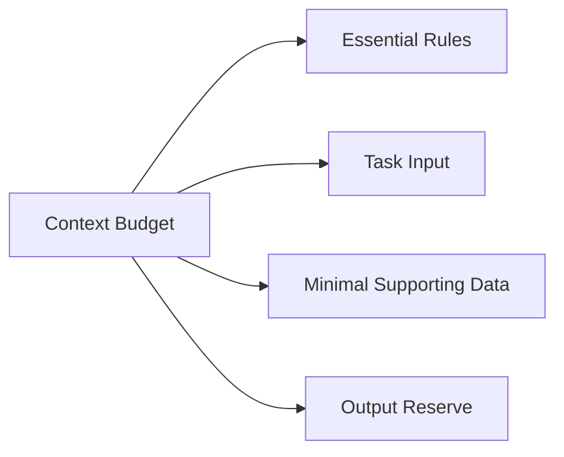
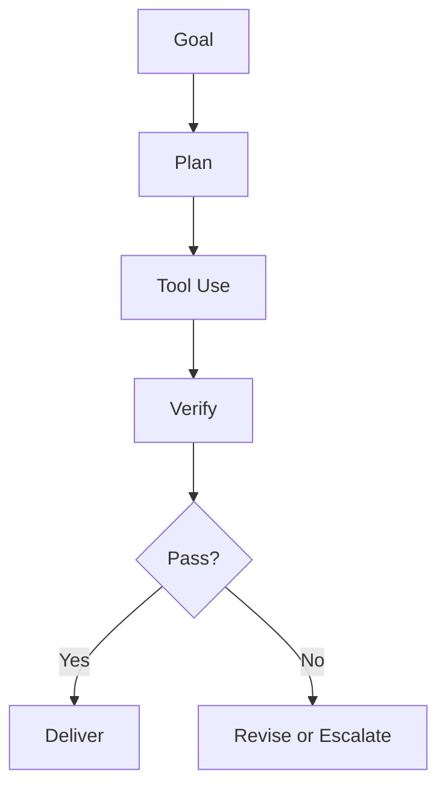

# Appendix 1: Prompt Engineering Cheatsheets

## A1.1 Quick Prompt Anatomy Cheatsheet

```text
Role -> Objective -> Context -> Constraints -> Output Format -> Quality Checks
```

Use this sequence as the default prompt skeleton.

---

## A1.2 CO-STAR Cheatsheet

```text
C: Context
O: Objective
S: Style
T: Tone
A: Audience
R: Response
```

Mini template:

```text
Context: ...
Objective: ...
Style: ...
Tone: ...
Audience: ...
Response: ...
```

---

## A1.3 Zero-Shot vs Few-Shot Decision Cheatsheet

| Situation                           | Use                                      |
| ----------------------------------- | ---------------------------------------- |
| Simple task, clear output           | Zero-shot                                |
| Nuanced style needed                | Few-shot                                 |
| Strict schema consistency required  | Few-shot                                 |
| Cost-sensitive high-volume requests | Zero-shot first, then escalate if needed |

---

## A1.4 Temperature Cheatsheet

| Temperature | Best Use                              |
| ----------- | ------------------------------------- |
| `0.0-0.3`   | Deterministic, extraction, compliance |
| `0.4-0.7`   | General business writing              |
| `0.8+`      | Ideation, creative brainstorming      |

Rule: higher temperature increases diversity and drift risk.

---

## A1.5 Context Window Management Cheatsheet

- Keep only relevant context.
- Summarize long histories.
- Prioritize high-value instructions.
- Reserve tokens for output.
- Remove duplicated constraints.



---

## A1.6 Hallucination Reduction Cheatsheet

- Ask for evidence from provided context only.
- Require "unknown" for missing facts.
- Separate observation vs inference.
- Add self-check criteria before final output.
- Use schema outputs for factual tasks.

---

## A1.7 Prompt Evaluation Cheatsheet

Score each output (0-2):

- Task completion
- Accuracy
- Constraint adherence
- Format compliance
- Clarity

Total: `/10`

Use threshold:

- `8-10`: production-ready
- `6-7`: revise before use
- `<=5`: redesign prompt

---

## A1.8 Reusable Prompt Snippets

### Clarifying Questions First

```text
If required information is missing, ask up to 3 clarifying questions before answering.
```

### Strict JSON Output

```text
Return valid JSON only. Do not include markdown or commentary.
```

### Constraint Check

```text
Before final answer, verify all constraints are satisfied. If not, revise once.
```

### Confidence Labels

```text
For each claim, include confidence: high, medium, or low.
```

---

## A1.9 Agent Prompting Cheatsheet

- Define tool-call policy
- Define retry and failure handling
- Limit loop iterations
- Add human escalation point
- Validate output before delivery



---

## A1.10 Personal Workflow Cheatsheet

Daily practice loop:

1. Write one prompt
2. Test on 5 inputs
3. Score quality
4. Improve prompt
5. Store as versioned template

Consistency beats complexity.
