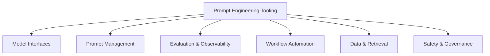

---
title: "Appendix 2: Useful Tools for Prompt Engineers"
sidebar_position: 12
---

# Appendix 2: Useful Tools for Prompt Engineers

## A2.1 Introduction

Prompt engineering productivity improves significantly when paired with the right toolchain for drafting, testing, evaluation, and workflow automation.

This appendix organizes tools by job-to-be-done rather than hype.

---

## A2.2 Tool Categories

---

## A2.3 Model Interfaces

Use for rapid prompting and experimentation.

- Provider-native playgrounds (for parameter tuning)
- API clients (for scripted testing)
- Notebook environments (for reproducible experiments)

Selection criteria:

- Model variety
- Parameter control
- Exportability
- Team collaboration support

---

## A2.4 Prompt Management Tools

Use for storing and versioning prompt assets.

What to look for:

- Version history
- Variable templating
- Environment separation (dev/stage/prod)
- Prompt diff and rollback
- Shared team library

Minimum setup if no platform is used:

- Git repository
- One prompt per file
- Changelog for each prompt revision

---

## A2.5 Evaluation and Observability Tools

Use for quality and regression control.

Core capabilities:

- Batch test execution
- Golden dataset comparisons
- Metric dashboards
- Failure trace inspection
- Cost and latency monitoring

Recommended baseline metrics:

- Accuracy
- Format compliance
- Hallucination rate
- Cost per successful task
- Median latency

---

## A2.6 Workflow Automation and Agent Tools

Use to turn prompts into production workflows.

Typical capabilities:

- Tool calling
- Agent orchestration
- Memory handling
- Retry and fallback logic
- Scheduling and triggers

Choose tools that support explicit policy controls and observability.

---

## A2.7 Data and Retrieval Tooling

Use for context injection and grounding.

Needs:

- Document ingestion pipelines
- Chunking and indexing
- Retrieval quality controls
- Metadata filtering
- Source citation support

Good retrieval quality often improves output quality more than prompt tweaks alone.

---

## A2.8 Safety and Governance Tooling

Use for responsible deployment.

Capabilities to prioritize:

- Content policy checks
- PII redaction
- Access control
- Audit trails
- Approval workflows for high-risk actions

Governance is essential for enterprise adoption.

---

## A2.9 Practical Starter Stack (Vendor-Neutral)

1. Prompt authoring: Markdown + Git
2. Testing: Batch runner + evaluation rubric
3. Monitoring: cost/latency + quality dashboard
4. Automation: orchestration layer with retry policies
5. Safety: policy checks + logging

This stack is sufficient for most early production teams.

---

## A2.10 Tool Selection Scorecard

Score each candidate tool from 1-5:

- Ease of integration
- Team usability
- Observability depth
- Governance support
- Cost efficiency
- Vendor lock-in risk

Total score helps compare options objectively.

---

## A2.11 Implementation Checklist

- Define one high-value use case
- Build baseline prompt workflow
- Add evaluation loop and metrics
- Add version control and rollback
- Add monitoring and governance checks
- Scale to additional workflows

---

## A2.12 Final Note

Tools should serve workflow quality, not replace prompt thinking.

A disciplined process with simple tools outperforms a complex stack without evaluation rigor.

