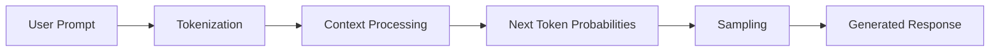
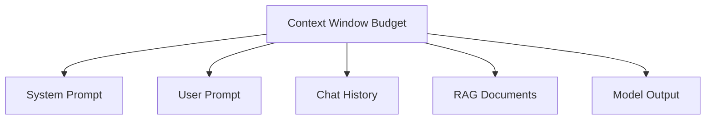
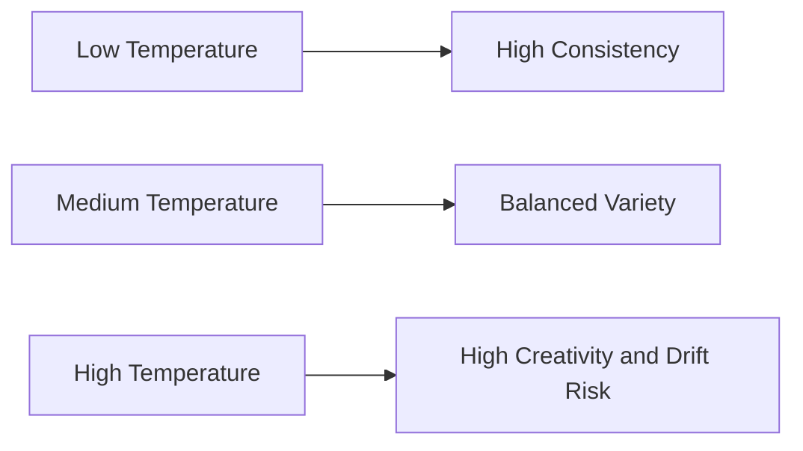

---
title: "Chapter 2: How LLMs Actually Think"
sidebar_position: 2
---

# Chapter 2: How LLMs Actually "Think" (Tokens, Context Windows, and Temperature)

## 2.1 Introduction

LLMs do not think like humans. They do not have beliefs, intentions, or true understanding. They predict the most likely next token based on patterns learned from training data and the context you provide.

For prompt engineers, this is good news. Once you understand the mechanics, output quality becomes much more controllable.

---

## 2.2 The Core Mental Model

An LLM workflow can be simplified into three stages:

1. Input is converted into tokens.
2. The model uses context to predict next-token probabilities.
3. A sampling strategy picks tokens repeatedly until completion.



This means your job is to optimize the model's probability landscape through clear instructions and constraints.

---

## 2.3 Tokens: The Real Unit of Language

A token is a chunk of text used internally by the model. It can be:

- A whole word
- Part of a word
- Punctuation
- Number fragments
- Whitespace patterns

Why tokens matter:

- Cost is often token-based.
- Latency scales with token count.
- Long, noisy prompts dilute important instructions.

### Practical Rules

- Use concise, explicit language.
- Remove redundant context.
- Keep critical instructions near the end or repeated in a checklist.
- Request compact output formats when appropriate (tables, bullets, JSON).

---

## 2.4 Context Window: The Model's Working Memory Limit

The context window is the total token capacity for:

- System instructions
- User prompt
- Conversation history
- Retrieved documents
- Model response

If you exceed this budget, older or less prioritized content can be truncated. Even before truncation, too much context can reduce attention quality.



### Context Management Strategies

- Summarize long history periodically.
- Inject only relevant retrieval chunks.
- Use section labels so instructions are easy to follow.
- Separate immutable rules from task-specific context.
- Reserve response budget (do not spend all tokens on input).

---

## 2.5 Temperature: Creativity vs Predictability

Temperature controls randomness during token selection.

- Low temperature (for example `0.0-0.3`): more deterministic, stable, and conservative.
- Medium temperature (`0.4-0.7`): balanced exploration.
- High temperature (`0.8+`): more diverse, higher risk of drift.



### Suggested Defaults by Task Type

- Compliance, legal-style formatting, structured extraction: low
- General business writing: medium
- Brainstorming, naming, ideation: medium-high

Temperature does not fix weak prompts. It amplifies prompt quality.

---

## 2.6 Why Outputs Sometimes Fail

Common failure patterns:

- Ambiguous objective
- Missing constraints
- Context overload
- Conflicting instructions across system and user messages
- Wrong temperature for task requirements
- No output format contract

Failure diagnosis checklist:

1. Is the task clearly defined in one sentence?
2. Are constraints explicit and testable?
3. Is context relevant and minimal?
4. Is output format forced?
5. Is temperature aligned with the task?

---

## 2.7 Prompt Design with Mechanistic Awareness

Use this structure when reliability matters:

```text
Role: You are a [specific expert role].
Objective: [single clear outcome].
Context: [only necessary facts].
Constraints:
1) [rule]
2) [rule]
3) [rule]
Output format: [exact structure]
Quality bar: [what must be true before finalizing]
```

This structure works because it narrows the model's probability space and reduces ambiguity.

---

## 2.8 Example: Weak Prompt vs Strong Prompt

### Weak

"Summarize this report quickly."

### Strong

```text
You are a business analyst.
Objective: Summarize the attached report for an executive audience.
Constraints:
1) Maximum 120 words
2) Include 3 key risks
3) Use plain language, no jargon
Output format:
- One-sentence overview
- Three bullet risks
- One recommended next action
```

Expected improvement:

- More consistent structure
- Higher actionability
- Reduced irrelevant content

---

## 2.9 Chapter 2 Practical Exercise

### Exercise: Tune prompt + temperature for different goals

Task input:

"Create a social media post about our new AI note-taking app."

Your challenge:

1. Write one prompt for a compliance-safe enterprise audience.
2. Write one prompt for creative marketing ideation.
3. Choose a temperature for each and justify why.
4. Define measurable acceptance criteria for both outputs.

Use this scoring rubric (0-2 each):

- Clarity
- Constraint adherence
- Audience fit
- Format quality
- Actionability

Total score: /10

---

## 2.10 Key Takeaways

- LLMs predict tokens, they do not reason like humans by default.
- Tokens affect quality, speed, and cost.
- Context windows are limited and must be managed intentionally.
- Temperature controls randomness, not truth.
- Reliable prompting is engineering: structure, constraints, testing, and iteration.

---

## 2.11 Next Chapter

In Chapter 3, we will break down the anatomy of a perfect prompt so you can design prompts that are clear, controllable, and reusable across tasks.


