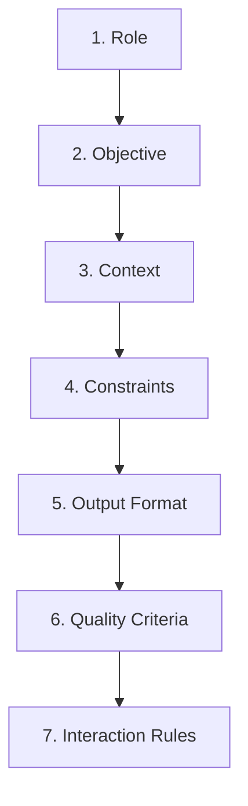
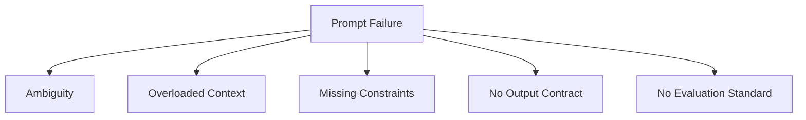

---
title: "Chapter 3: The Anatomy of a Perfect Prompt"
sidebar_position: 3
---

# Chapter 3: The Anatomy of a Perfect Prompt

## 3.1 Introduction

A high-performing prompt is rarely long, but it is almost always structured.

Most weak prompts fail because they are missing one or more essential components: a clear objective, relevant context, explicit constraints, or a strict output contract. In this chapter, you will learn the exact building blocks of a professional prompt and how to combine them for consistent results.

---

## 3.2 What "Perfect" Means in Prompt Engineering

In practice, "perfect" does not mean "always correct." It means:

- Reliable across varied inputs
- Easy to evaluate
- Easy to revise
- Aligned to task goals, quality standards, and cost limits

A perfect prompt is therefore an engineering asset, not a one-time sentence.

---

## 3.3 The 7 Core Components of a High-Quality Prompt



### 1) Role
Defines perspective and expertise.

Example: "You are a senior product analyst."

### 2) Objective
Defines success in one sentence.

Example: "Summarize customer feedback into top 5 product risks."

### 3) Context
Provides necessary facts, audience, and domain boundaries.

Example: "Feedback is from enterprise admins in regulated industries."

### 4) Constraints
Defines hard limits.

Examples:
- Word count
- Required inclusions/exclusions
- Tone boundaries
- Policy or compliance rules

### 5) Output Format
Forces response shape.

Examples:
- Bullet list
- Table
- JSON schema
- Email structure

### 6) Quality Criteria
Defines what makes the answer acceptable.

Examples:
- Must be accurate to provided context
- Must avoid speculation
- Must include evidence tags

### 7) Interaction Rules
Controls behavior when information is missing or ambiguous.

Example: "If data is insufficient, ask up to 3 clarifying questions before answering."

---

## 3.4 Visual Blueprint of a Production Prompt


Use this order by default. It reduces ambiguity and improves model compliance.

---

## 3.5 Prompt Blueprint Template (Reusable)

```text
You are [role].

Objective:
- [single clear goal]

Context:
- [relevant fact 1]
- [relevant fact 2]
- [relevant fact 3]

Constraints:
1) [hard rule]
2) [hard rule]
3) [hard rule]

Output format:
- [exact structure required]

Quality criteria:
- [acceptance condition 1]
- [acceptance condition 2]

If information is missing:
- [clarification behavior]
```

This template should be your starting point for most professional tasks.

---

## 3.6 From Weak to Strong: Practical Transformations

### Example A: Content Writing

Weak:
"Write a blog intro about AI in healthcare."

Strong:

```text
You are a healthcare technology writer.
Objective: Write an introductory section for a blog on AI in healthcare operations.
Audience: Hospital administrators with non-technical background.
Constraints:
1) 120-150 words
2) Plain language, no hype
3) Include one practical operational example
4) Do not provide medical diagnosis advice
Output format:
- Heading
- Intro paragraph
- 3 bullet takeaways
Quality criteria:
- Accurate, clear, action-oriented
```

### Example B: Information Extraction

Weak:
"Extract key points from this contract."

Strong:

```text
You are a legal operations assistant.
Objective: Extract operationally relevant clauses from the contract text.
Constraints:
1) Return only information present in the input
2) No legal interpretation beyond stated text
3) Flag missing or unclear clauses
Output format (JSON):
{
  "term_length": "",
  "renewal_clause": "",
  "termination_clause": "",
  "payment_terms": "",
  "risk_flags": []
}
Quality criteria:
- Valid JSON
- No invented fields
- Use "not specified" when absent
```

---

## 3.7 Anatomy of Failure: What Breaks Prompt Quality

Common structural failures:

- No objective (model guesses intent)
- Too much irrelevant context (attention dilution)
- Soft constraints instead of explicit rules
- Missing output format (inconsistent responses)
- No quality criteria (hard to evaluate)
- Contradictory instructions (unstable behavior)



---

## 3.8 Precision Patterns You Should Reuse

- "Return only the final answer in [format]."
- "If uncertain, state uncertainty explicitly."
- "Do not use information outside the provided context."
- "Limit response to [X] words."
- "Before final output, verify against these checks: [list]."

These patterns improve control and reduce hallucination risk.

---

## 3.9 Chapter 3 Practical Exercise

### Exercise: Build a Prompt Anatomy Scorecard

Choose one real task (for example email drafting, report summary, extraction, or planning), then:

1. Write a first prompt draft.
2. Score it from 0-2 on each component:
- Role
- Objective
- Context
- Constraints
- Output format
- Quality criteria
- Interaction rules
3. Improve weak components.
4. Test on 3 different inputs.
5. Record consistency and revision notes.

Scoring range: `/14`

Target quality bar: `>= 12/14`

---

## 3.10 Key Takeaways

- Great prompts are structured systems, not clever wording.
- The 7-component anatomy is a reliable default for most tasks.
- Output format and quality criteria are essential for repeatability.
- Prompt quality improves fastest when measured with a scorecard.

---

## 3.11 Next Chapter

In Chapter 4, we will compare zero-shot and few-shot prompting so you can decide when examples are necessary and how many examples produce the best tradeoff between quality, speed, and token cost.


