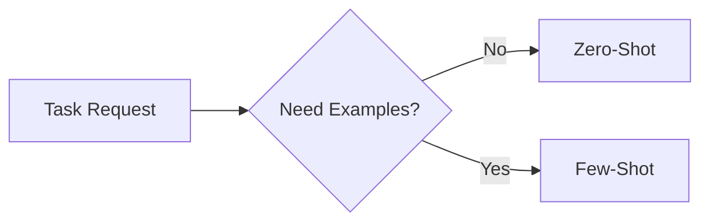
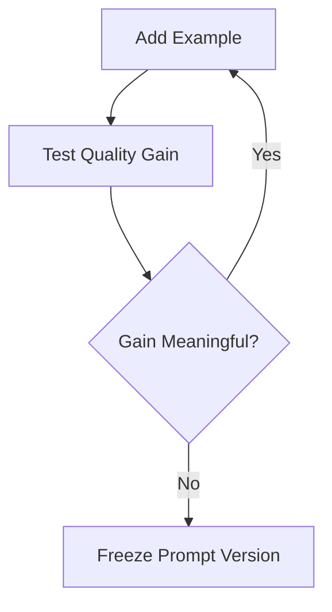

---
title: "Chapter 4: Zero-Shot vs Few-Shot Prompting"
sidebar_position: 4
---

# Chapter 4: Zero-Shot vs. Few-Shot Prompting

## 4.1 Introduction

One of the most important design choices in prompt engineering is deciding whether to provide examples.

- Zero-shot prompting gives only instructions.
- Few-shot prompting gives instructions plus examples.

Choosing correctly affects quality, consistency, speed, and cost.

---

## 4.2 Quick Definitions

### Zero-Shot Prompting
You ask the model to perform a task without showing examples.

### Few-Shot Prompting
You include a small number of examples (usually 1-5) demonstrating the expected input-output pattern.



---

## 4.3 When Zero-Shot Works Best

Use zero-shot when:

- Task is simple and common
- Output format is straightforward
- You want lower token cost and faster response
- You can enforce clear constraints directly

Example tasks:

- Summarize a paragraph in 3 bullets
- Rewrite text with simpler vocabulary
- Classify sentiment as positive/negative/neutral

### Zero-Shot Template

```text
You are [role].
Objective: [task].
Constraints:
1) [rule]
2) [rule]
Output format: [format]
```

---

## 4.4 When Few-Shot Works Best

Use few-shot when:

- Task has nuanced style or domain-specific behavior
- Format is strict and non-trivial
- You need consistent tone/structure across outputs
- You are teaching edge-case handling

Example tasks:

- Structured extraction with domain labels
- Brand-specific tone writing
- SQL query generation style constraints
- Policy-sensitive response formatting

### Few-Shot Template

```text
You are [role].
Objective: [task].
Constraints: [rules]

Examples:
Input: [example 1 input]
Output: [example 1 output]

Input: [example 2 input]
Output: [example 2 output]

Now solve:
Input: [new input]
Output:
```

---

## 4.5 Tradeoff Matrix: Zero-Shot vs Few-Shot

| Dimension | Zero-Shot | Few-Shot |
|---|---|---|
| Token Cost | Lower | Higher |
| Speed | Faster | Slower |
| Setup Effort | Low | Medium |
| Output Consistency | Medium | High |
| Style Control | Medium | High |
| Edge-Case Guidance | Low | Medium-High |

---

## 4.6 Example: Same Task, Two Approaches

Task: Extract invoice fields into JSON.

### Zero-Shot Version

```text
Extract the following fields from the invoice text and return JSON:
invoice_number, invoice_date, vendor_name, total_amount.
Use "not found" for missing values.
Return valid JSON only.
```

### Few-Shot Version

```text
Extract invoice fields and return valid JSON.
Fields: invoice_number, invoice_date, vendor_name, total_amount.
Use "not found" when absent.

Example Input:
Invoice No: INV-1209
Date: 2026-01-14
Seller: Delta Supplies
Total Due: $1,240.50

Example Output:
{
  "invoice_number": "INV-1209",
  "invoice_date": "2026-01-14",
  "vendor_name": "Delta Supplies",
  "total_amount": "$1,240.50"
}

Now parse this input:
[INVOICE TEXT]
```

Few-shot usually improves field mapping consistency.

---

## 4.7 How Many Examples Should You Use?

Start with:

- 0 examples for simple tasks
- 2 examples for patterned tasks
- 3-5 examples for high-variance tasks

Stop adding examples when quality gains flatten versus token cost.



---

## 4.8 Common Mistakes

- Examples that contradict written rules
- Too many examples causing context bloat
- Examples with hidden bias or weak quality
- Examples not matching target task distribution
- Forgetting to specify how to handle missing data

Few-shot is only as good as the examples you curate.

---

## 4.9 Chapter 4 Practical Exercise

Choose one task (classification, extraction, rewriting, summarization):

1. Build a zero-shot prompt.
2. Build a two-example few-shot prompt.
3. Test each on 10 inputs.
4. Score with a rubric:
- Accuracy (/10)
- Format compliance (/10)
- Consistency (/10)
- Cost efficiency (/10)
5. Decide which approach is better for production and justify.

---

## 4.10 Key Takeaways

- Zero-shot is efficient and fast for simple or well-bounded tasks.
- Few-shot is better for consistency and nuanced behavior.
- Example quality matters more than example quantity.
- Always evaluate gains against token and latency costs.

---

## 4.11 Next Chapter

In Chapter 5, we will move from structure control to reasoning control using Chain-of-Thought and Tree-of-Thought approaches.


