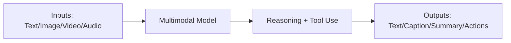
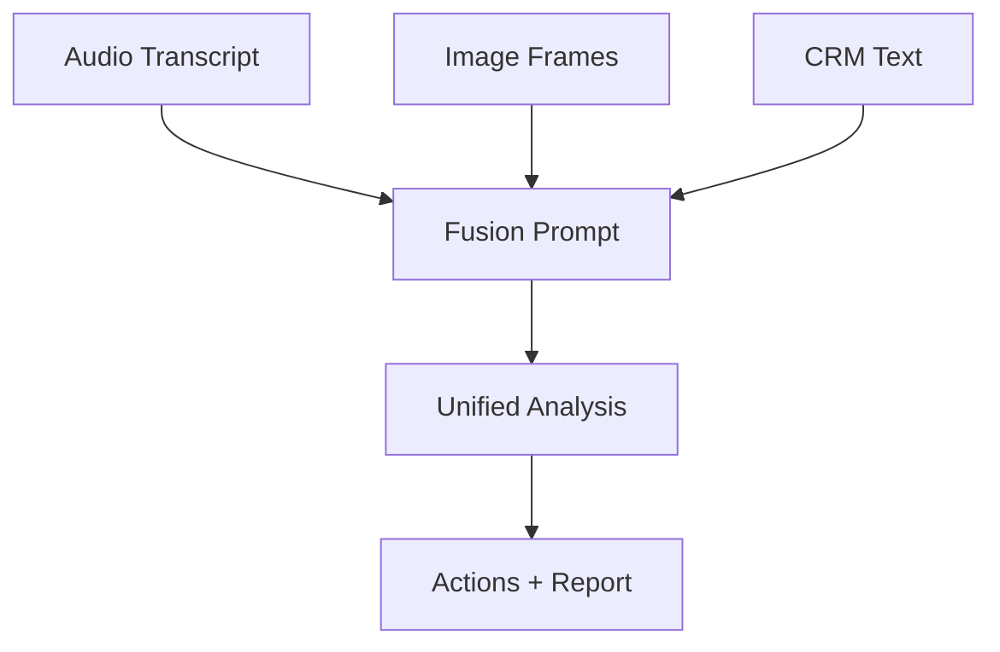

---
title: "Chapter 7: Multimodal Prompting (Images, Video, and Audio)"
sidebar_position: 7
---

# Chapter 7: Multimodal Prompting (Images, Video, and Audio)

## 7.1 Introduction

Modern AI systems are multimodal: they can process and generate across text, images, video, and audio. Prompt engineering now includes instruction design for mixed-input workflows.

Multimodal prompting is not only about creativity. It is increasingly used for operations, accessibility, training, analysis, and automation.

---

## 7.2 Multimodal Prompting Mental Model



The prompt must specify:

- What modality is provided
- What to extract or generate
- How to handle uncertainty
- Required output format

---

## 7.3 Prompting with Images

Common tasks:

- OCR and document extraction
- Chart interpretation
- UI/UX critique
- Scene analysis
- Visual content safety checks

### Image Prompt Template

```text
Task: Analyze the provided image.
Goal: [specific objective]
Constraints:
1) Use only visible evidence
2) If unclear, state uncertainty
3) Do not infer hidden details
Output format:
- Observations
- Inferences (low/medium/high confidence)
- Recommended action
```

Best practice: Separate observation from inference.

---

## 7.4 Prompting with Video

Video requires temporal reasoning (what changed over time).

Common tasks:

- Event timeline extraction
- Key moment summarization
- Compliance monitoring
- Training content indexing

### Video Prompt Template

```text
Analyze the video and produce:
1) Timeline with timestamps
2) Key events
3) Risk/compliance flags
4) Final summary in <= 120 words
Only include events visible/audible in the video.
```

---

## 7.5 Prompting with Audio

Common tasks:

- Transcription cleanup
- Speaker separation summary
- Call quality analysis
- Meeting action extraction

### Audio Prompt Template

```text
Process the audio transcript.
Tasks:
1) Summarize discussion in 5 bullets
2) List action items with owners and deadlines
3) Flag unclear or missing information
Output format: JSON
```

Tip: Always include missing-data behavior (for example: "owner_unknown").

---

## 7.6 Cross-Modal Workflows

Many real workflows combine modalities.

Example: Sales call review

- Audio: customer concerns
- Slide screenshots: product promises
- Text CRM notes: deal context



Prompt design must define source priority and conflict resolution.

---

## 7.7 Multimodal Failure Modes

- Hallucinating details not present in media
- Ignoring timestamps or temporal order
- Mixing observations and assumptions
- Losing format consistency across modalities
- Under-specifying confidence requirements

Mitigation rules:

- Ask for evidence-based output
- Require confidence labels
- Force schema output for downstream automation
- Add "unknown"/"unclear" states

---

## 7.8 Chapter 7 Practical Exercise

1. Choose one image and one short audio/video sample.
2. Write separate prompts for each modality.
3. Write one fusion prompt combining both.
4. Enforce this output schema:
- Observed facts
- Inferred insights
- Confidence level
- Recommended action
5. Evaluate for factual grounding and format consistency.

---

## 7.9 Key Takeaways

- Multimodal prompting requires modality-aware instructions.
- Temporal and evidence constraints are critical for video/audio.
- Separate observation from inference to reduce hallucination risk.
- Schema-first outputs improve integration with tools and workflows.

---

## 7.10 Next Chapter

In Chapter 8, we move to career execution and build a professional prompt portfolio that demonstrates real, measurable capability.


