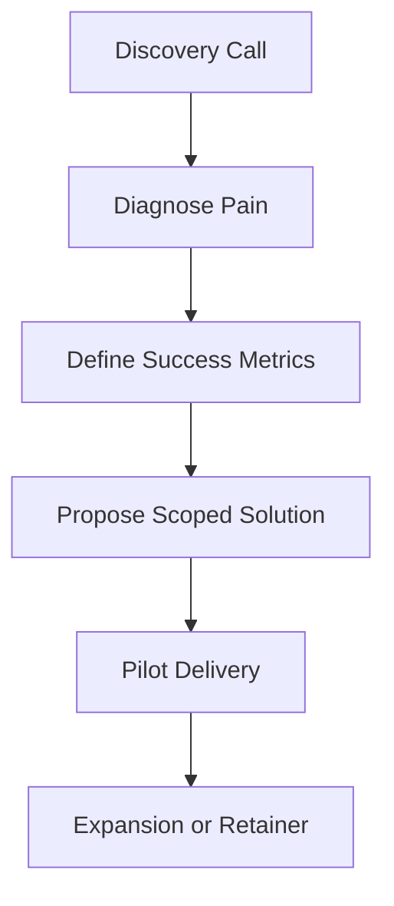

---
title: "Chapter 9: Monetization"
sidebar_position: 9
---

# Chapter 9: Monetization: Freelancing, Consulting, and Prompt Marketplaces

## 9.1 Introduction

Prompt engineering becomes economically valuable when you can link your work to business outcomes. Monetization is not about selling prompts in isolation; it is about solving operational problems with measurable ROI.

---

## 9.2 Monetization Pathways

Primary pathways in 2026:

1. Freelancing
2. Consulting
3. Productized services
4. Prompt/template marketplaces
5. Internal AI enablement roles


---

## 9.3 Freelancing Model

Best for fast entry and iterative learning.

Typical services:

- Prompt optimization
- Workflow automation support
- AI content quality improvement
- Prompt QA and evaluation setup

Pricing models:

- Per project
- Weekly retainers
- Milestone-based packages

Freelancing success factors:

- Fast delivery cycles
- Clear scope boundaries
- Strong revision policy

---

## 9.4 Consulting Model

Best for larger clients and strategic engagements.

Typical consulting engagements:

- AI workflow diagnostics
- Prompt governance frameworks
- Team training and SOP design
- Deployment playbooks for departments

Consulting requires stronger discovery, stakeholder communication, and change-management skills.

---

## 9.5 Productized Prompt Services

Instead of custom work every time, offer fixed packages such as:

- "Prompt Audit in 7 Days"
- "Support Prompt System Setup"
- "CO-STAR Prompt Library for Sales Team"

Benefits:

- Clear deliverables
- Easier sales process
- Better capacity planning

---

## 9.6 Prompt Marketplaces

You can sell:

- Prompt packs by domain
- Prompt templates + instructions
- Prompt evaluation rubrics
- Workflow kits (prompts + examples + test cases)

Marketplaces can provide scalable distribution, but competition is high. Differentiation comes from specialization and evidence-based quality.

---

## 9.7 Building Offers That Sell

Define each offer by:

- Problem solved
- Target audience
- Deliverables
- Timeline
- Success metric
- Pricing range

### Offer Canvas

```text
Offer Name:
Audience:
Problem:
Deliverables:
Timeline:
Success Metric:
Price:
```

---

## 9.8 Sales Conversation Framework



Avoid selling generic prompts. Sell measurable outcomes.

---

## 9.9 Risk and Ethics in Monetization

- Never claim guaranteed accuracy in high-stakes domains
- Do not use confidential client data in public portfolio
- Be transparent about model limitations
- Define human review requirements for sensitive tasks

Strong trust practices improve long-term client retention.

---

## 9.10 Chapter 9 Practical Exercise

1. Create 3 monetizable offers using the offer canvas.
2. Choose one niche (for example legal ops, e-commerce, SaaS support).
3. Draft a one-page service proposal.
4. Define pilot success metrics and acceptance criteria.
5. Simulate a client FAQ with objections and responses.

---

## 9.11 Key Takeaways

- Monetization depends on outcomes, not prompt novelty.
- Freelancing is fastest to start; consulting scales strategic impact.
- Productized services improve repeatability and margins.
- Ethical boundaries and clear risk communication are non-negotiable.

---

## 9.12 Next Chapter

In Chapter 10, we look ahead to prompt engineering for AI agents and autonomous workflows, where prompts become orchestration logic rather than single-turn instructions.


