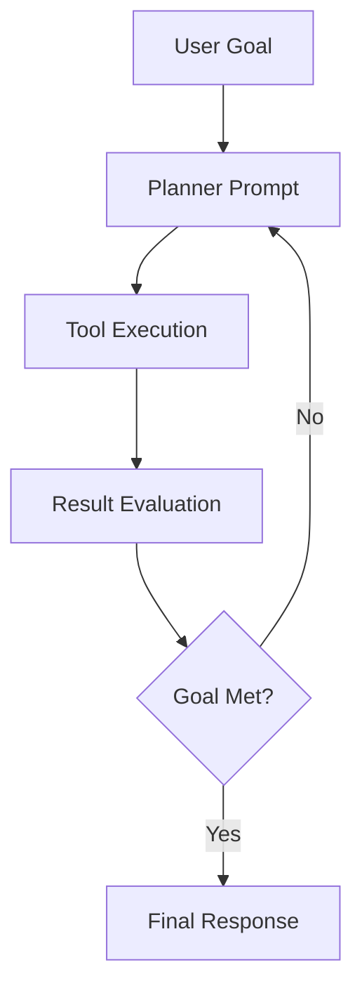
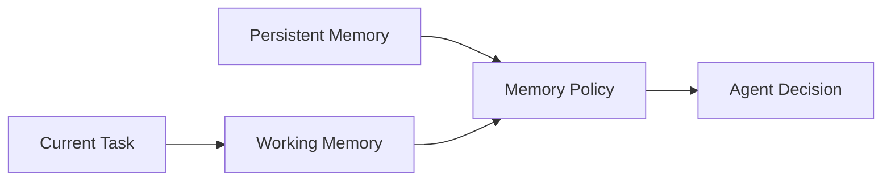
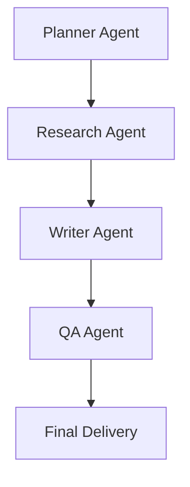

---
title: "Chapter 10: The Future: Prompting for AI Agents"
sidebar_position: 10
---

# Chapter 10: The Future: Prompting for AI Agents and Autonomous Workflows

## 10.1 Introduction

Single prompts are evolving into agent workflows. In this paradigm, prompts define behavior across planning, tool use, memory, and decision loops.

Prompt engineering in agent systems is closer to system design: you define policies, handoffs, and recovery behavior.

---

## 10.2 From Chat Prompts to Agent Prompts

Traditional prompting:

- Single input -> single output

Agent prompting:

- Goal input -> plan -> tool actions -> verification -> final output



---

## 10.3 Core Components of Agent Prompting

1. Role and scope boundaries
2. Planning strategy
3. Tool selection policy
4. Memory and context policy
5. Verification criteria
6. Escalation and fallback rules

If any of these are unclear, autonomous workflows become brittle.

---

## 10.4 Prompting for Tool Use

Agent prompts should define:

- When a tool may be called
- Which inputs are required before calling
- How tool errors are handled
- How results are validated before response

### Tool-Use Policy Snippet

```text
Tool Use Rules:
1) Call retrieval tool before answering factual questions.
2) If retrieval confidence is low, ask clarification.
3) Do not call external tools for subjective writing tasks.
4) On tool failure, retry once, then return structured error state.
```

---

## 10.5 Memory-Aware Prompt Design

Agent systems often use short-term and long-term memory.

- Short-term memory: current task context
- Long-term memory: user preferences, prior decisions, persistent facts

Prompt rules must specify memory write/read policy to avoid stale or unsafe behavior.



---

## 10.6 Verification and Guardrails

Autonomy without verification increases risk.

Include explicit checks:

- Constraint validation
- Source grounding
- Safety and policy checks
- Final schema validation

### Verification Prompt Pattern

```text
Before finalizing:
1) Verify output meets all constraints.
2) Verify claims are grounded in retrieved evidence.
3) If any check fails, revise once.
4) If still failing, return a structured failure report.
```

---

## 10.7 Multi-Agent Orchestration

In advanced systems, specialized agents collaborate.

Examples:

- Planner agent
- Research agent
- Writer agent
- QA agent



Prompts define handoff contracts between agents.

---

## 10.8 Failure Modes in Autonomous Workflows

- Tool overuse or wrong tool choice
- Infinite planning loops
- Memory contamination
- Confident but unverified outputs
- Silent failures without escalation

Mitigation:

- Iteration limits
- Tool allowlists
- Structured error states
- Human-in-the-loop checkpoints

---

## 10.9 Chapter 10 Practical Exercise

Design a mini autonomous workflow for "Weekly competitor intelligence report":

1. Planner prompt
2. Retrieval/tool prompt policy
3. Synthesis prompt
4. QA prompt
5. Final report schema

Test on 3 runs and measure:

- Task completion rate
- Factual grounding rate
- Error recovery success
- Human edit effort

---

## 10.10 Final Course Takeaways

- Prompt engineering is moving from text instruction to workflow orchestration.
- Agent reliability depends on explicit policies, not model capability alone.
- Verification, memory governance, and fallback logic are essential.
- The future belongs to prompt engineers who combine language precision with system thinking.

---

## 10.11 What to Do Next

- Build 2-3 domain-specific prompt systems
- Create measurable case studies
- Design one agent workflow with tool and QA loops
- Continue evolving prompts as versioned, testable assets


