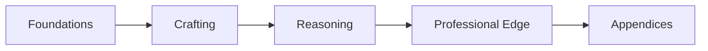

---
title: "Course Introduction"
sidebar_position: 0
---

# Gen AI Prompt Engineer 101

Welcome to the published documentation version of the **Gen AI Prompt Engineer 101: From Basics to Mastery (2026 Edition)** guide.

This site is designed for progressive learning from fundamentals to advanced agentic workflows.

## What You Will Learn

- Prompt engineering foundations and mental models
- Tokens, context windows, and temperature behavior
- Prompt design frameworks (including CO-STAR)
- Reasoning methods (CoT and Tree-of-Thought)
- Multimodal prompting across text, image, video, and audio
- Career execution: portfolio, consulting, and monetization
- Future-facing agent workflow prompting

## Learning Path

## Recommended Study Method

1. Read one chapter at a time.
2. Complete the practical exercise in the chapter.
3. Test your prompt on multiple inputs.
4. Evaluate with a rubric.
5. Save your best prompt version.

Continue to **Part 1** from the left sidebar.

